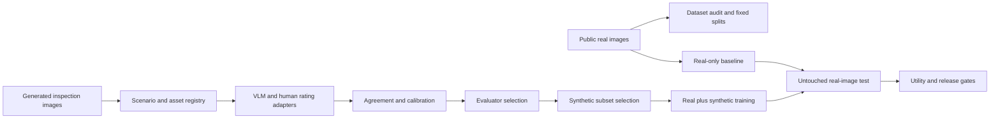

# System architecture

The real-image test split is kept separate from generated images and evaluator
selection. Synthetic data earns a positive result only when it improves an
untouched real benchmark without weakening the protected defect metric.

The current implementation uses local MLX, batched Transformers, and structured
JSON adapters behind the same evaluation contracts. Dataset licenses, source
checksums, experiment seeds, and non-claims travel with each result artifact.

As the project grows, the first change should be replacing the small AGDD
holdout with a larger, separately sourced aircraft dataset. Distributed judging
and model adaptation come after that evidence gap is closed.
